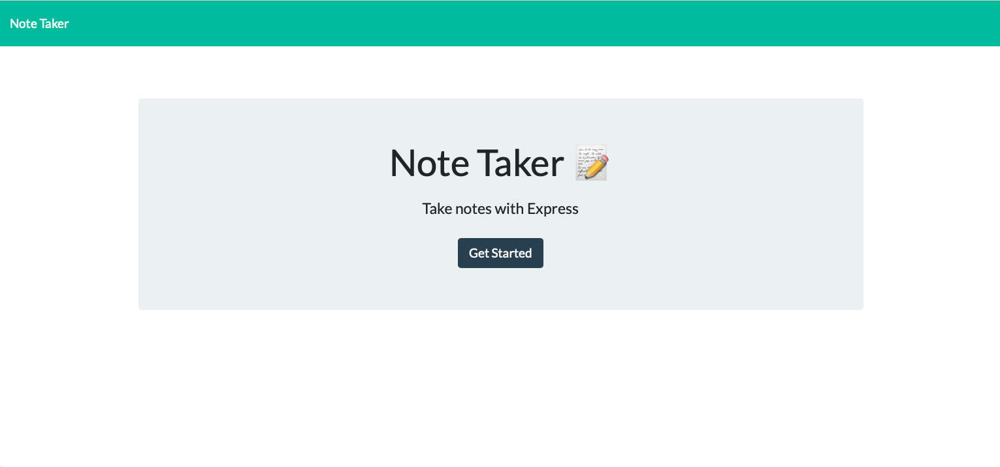
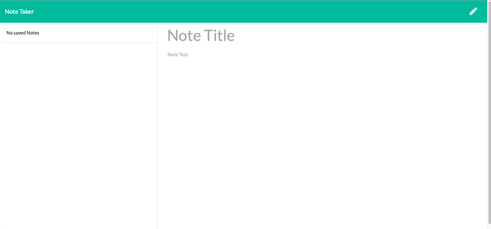
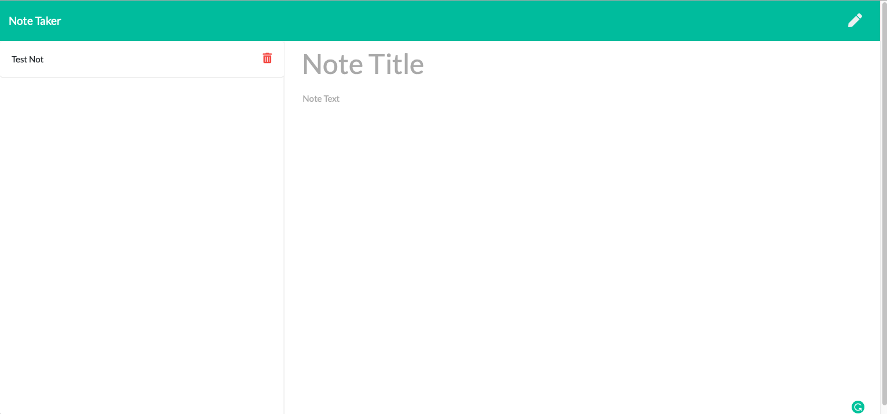

# Note Taker
 
  
---

## Description
An application that can be used to write, save, and delete notes. This application will uses an express backend and saves and retrieves note data from a JSON file.

---
## Table of Contents
  
1. [ Description ](#description)
2. [ Visuals ](#visuals)
3. [ Demo](#demo)
4. [ Installation](#installation)
5. [ Usage ](#usage)
6. [ License ](#license)
7. [ Contributing ](#contributing)
8. [ Tests ](#tests)
9. [ Questions ](#questions)

 ---

## Visuals
  

---

## Demo

Checkout the [demo page](https://murmuring-fjord-03071.herokuapp.com) to see Note Taker in action.

---

## Installation

  
1. Run the following command at the root of your project.

    ``
    npm install
    ``

2. Run the command.

    ``sh
    heroku create
    ``

3. Run the command 
  
    ``sh
    git push heroku master.
    ``

4. Log in to your [Heroku account](https://id.heroku.com/login).

5. Click on settings. Then, scroll down until you see "Domains". Note the URL listed under Heroku Domain.

6. Navigate to that URL in your browser. 

---

## Usage

1. Click on `Get Started`.

2. Click on `Note Title` and enter an new title.

3. Click on `Note Text` and enter some text. You will notice a floppy disk icon appears in the upper right of the screen.

4. Click on the floppy disk icon in the upper right of the screen.

5. You will see your New Note on the left of the screen. 

6. You can now do the following

    i. Enter another note.

    ii. View your note by click on the title on the left. (To create a new note when viewing a note click on the pencil on the upper right of the screen.)

    iii. Delete a note by clicking on the trash can. (Be careful this will permanently delete the note.)

Note:  Keep in mind that is a shared application and any notes you enter can be accessed by anyone with access to the application.
  
---

## License

Copyright (c) 2020, Andrew Crow. (MIT License)

---

## Contributing

We are currently not allowing outside contributors to this project, but check back because things can change.

---

## Tests

  

---

## Questions

If you have questions you can reach me here:
  
Email: andrew@crow.me

GitHub: [Github Profile](https://github.com/crowandrew)

---

